<h1 align="center">Chat with Conversation Annotator for Chatbot </h1>

[View the live project here.](http://flask-ai-chat-annotate.herokuapp.com/)
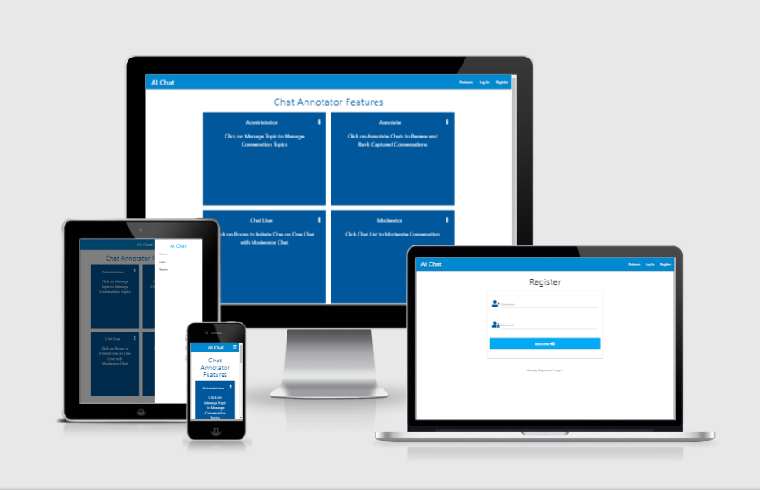

This is a chat application interface with a conversation data annotation feature. It is designed to capture actual conversations via the chatbot with annotation to improve the accuracy and quality of the bot conversations.

Data annotators will have access to annotate chat conversations for training AI chatbot for greater accuracy of Chatbot conversations

This application is intended to be lightweight, low maintenance, easy to implement and, easy to use. It enables a business to collect conversations as part of its services operations.

The goal is to provide a tool for actualizing a digital transformation strategy that includes implementing AI and chatbots to optimize operations.

<h2 align="center"></h2>

## Operational Features

A chat application with conversation data prep to feed into an AI model (not included in the scope)

- Build a real-time chat application (chat room if not too complex) for one on one conversations
- Using Flask Session and python to process conversations and store them in a non-relational database using MongoDB
- The MongoDB schema will support annotating the CRUD functions including classifying, rating, editing and, removing conversations
- A form interface will allow for a data analyst to annotate the conversations
- Real-time chat functionality will be implemented using Flask session with AJAX and be replace by Flask.socketIO as a future enhancement
- A minimally viable UX is intentional and will be developed using Materialize with Flask frame to focus the initial version of the application on data
- Chat Application will include feature description with instructions, self-service, user account creation, user role and access administration
- MongoDB database schema is API ready for JASON extract for external AI modeling

## Contents

- [Operational Features](#operational-features)
- [User Experience (UX)](<##User-Experience-(UX)>)
- [User Stories](#user-stories)

* [Database Model - Chat Annotator](#database-model---chat-annotator)
  - [Flexible Schema - Collections](#flexible-schema---collections)
  - [Embedded Data Document Structure](#embedded-data-document-structure)
  - [Single Document](#single-document)
  - [Collections Reference Relationships](#collections-reference-relationships)
  - [Collection Element - List of Values](#collection-element---list-of-values)
* [Development Planes](#development-planes)
  - [Strategy Plane - User Needs and Business Objective](#strategy-plane---user-needs-and-business-objective)
    - [Chat and Annotation Workflow](#chat-and-annotation-workflow)
  - [Scope Plane](#scope-plane)
    - [Personas](#personas)
    - [Release 1(Current) Features with Database CRUD](<###Release-1(Current)-Features-with-Database-CRUD>)
    - [Extended Features for future releases](#extended-features-for-future-releases)
  - [Structure Plane](#structure-plane)
    - [MVC Architecture](#mvc-architecture)
    - [Access to Functions and Navigation by Role Type](#access-to-functions-and-navigation-by-role-type)
    - [Routes Map to Business Function](#routes-map-to-business-function)
    - [Application Function Access](#application-function-access)
  - [Skeleton Plane](#skeleton-plane)
    - [Flask with Python MVC Framework - Request-Response Cycle](#flask-with-python-mvc-framework---request-response-cycle)
    - [Wireframes](#wireframes)
      - [Mobile](#mobile)
      - [Computers and Tablets Pages](#computers-and-tablets-pages)
    - [Application Features](#--application-features--)
    - [Future Enhancements](#future-enhancements)
  * [Surface Plane](#surface-plane)
    - [MongoDB Entities CRUD Operations by Role Type](#mongodb-entities-crud-operations-by-role-type)
    - [Application Feature Highlights](#application-feature-highlights)
    - [Chat Application Features](#chat-application-features)
    - [Seeded Data using Atlas Data Explorer](#seeded-data-using-atlas-data-explorer)
    - [Conversations MongoDB Index on Topic Name](#conversations-mongodb-index-on-topic-name)
    - [Chat and Annotation Workflow](#chat-and-annotation-workflow-1)
    - [Error Handling](#error-handling)
  - [Testing](#testing)
  - [Heroku Deployment](#heroku-deployment)
  - [Technologies](#technologies)
  - [Content Credits](#content-credits)
  - [Media](#media)
  - [Tutorial References](#tutorial-references)
  - [References](#references)
  - [Credits](#credits)
  - [Disclaimer](#disclaimer)

## User Experience (UX)

The purpose is to provide a simple user interface that is intuitive with only the necessary functions for a chat application.

## User Stories

### User Chat Session

1. As a User, I want to be able to select a topic for a conversation to speak with an expert
1. As a User, I want to be able to have a real-time conversation session
1. As a User, I want to be able to review the entire conversation during the session
1. As a User, I want to be able to end a conversation when completed
1. As a User, I want to be able to handle one active session at any time
1. As a user, I want to be able to logout
1. As a user, I want to be notified when I use the incorrect credentials at login
1. As a new User, I want to be able to register as a user for the application to participate in a conversation
1. As a retuning User, I want to be to access the application using registered credentials

_Future Enhancment_

- As a returning user, I want to reset my password
- As a User, I want to be notified of a Moderator is online and available for a conversation
- As a User, I want to be able to rate the conversation to provide feedback on whether it was satisfactory
- As a User, I want to be able to provide feedback on the conversation experience

### Moderator Response to User

1. As a Moderation, I want to be able to view the list of chats that are pending a moderator to respond
1. As a Moderator, I want to be able to view a list of chats that are currently assigned to other moderators
1. As a Moderator, I want to be able to respond to questions from a user in real-time to assist the user
1. As a Moderator, I want to be able to conduct one active conversation session one at any time
1. As a Moderator, I want to be able to terminate a conversation session to indicate completion of the conversation session

_Future Enhancment_

1. As a moderator, I want to be able to select to respond to users by topic name

### Chat Conversation Annotator

Review and Rate Conversations

1. As an Annotator, I want to be able to review and annotate conversation to be used for training AI bot
1. As an Annotator, I want to check to see if any new conversations need annotation
1. As an Annotator, I want to be able to search by conversations by topic name for the annotation
1. As an Annotator, I want to be able to rate the quality of the conversation

_Future Enhancement_

1. As an Annotator, I want to be able to reclassify the conversation to the correct topic for training AI Bot
1. As an Annotator, I want to be able to add a new topic to the list of topics
1. As an Annotator, I want to modify the conversation to deliver an accurate response to questions
1. As an Annotator, I want to confirm if user rating aligns with annotation rating

### Chat Administrator Manage Conversation Topic Tags

1. As an Administrator, I want to add new topic tags to categorize conversations
1. As an Administrator, I want to update topic tags to

_Future Enhancements_

- Implement restrictions so that topic tags cannot be deleted when used to tag conversation
- As an Administrator, I can deactivate any user to revoke access to the application
- As an Administrator, I can assign roles to a user
- As an Administrator, I can delete any conversation if requested by the user to comply with GDPR regulation

# Database Model - Chat Annotator

```
Design Principle - Atomicity and Transactions
In most cases, multi-document transaction incurs a greater performance cost over single document writes,and the availability of multi-document transactions should not be a replacement for effective schema design.

For many scenarios, the denormalized data model (embedded documents and arrays) will continue to be optimal for your data and use cases.

That is, for many scenarios, modeling your data appropriately will minimize the need for multi-document transactions.
```

Source: [Atomicity and Transactions](https://docs.mongodb.com/manual/core/write-operations-atomicity/)

The product of this AI chat Annotator application is to capture actual conversations that can be extracted to train chat bots models that are available. One example is Chatterbot a machine learning, conversational dialogue engine.

```

from chatterbot.trainers import ListTrainer

trainer = ListTrainer(bot)

trainer.train([
'How are you?',
'I am good.',
'That is good to hear.',
'Thank you',
'You are welcome.',
])

```

Reference:
[Operational Factors and Data Models](https://docs.mongodb.com/manual/core/data-model-operations/)
[Chatterbot](https://chatterbot.readthedocs.io/en/stable/examples.html)

A detailed description of the design of the database components applying the principles above to capture the conversations is detailed in the following charts.

## Flexible Schema - Collections

| Collection    | Description                                                                                                         | Usage                                                                                                                |
| ------------- | ------------------------------------------------------------------------------------------------------------------- | -------------------------------------------------------------------------------------------------------------------- |
| Feature       | Operational Feature Name, Quick Start Information, Description, and Instructions for each Feature by User role type | Seeded information used on the feature page stored in the database to allow manual updates without code modification |
| Conversations | Chat conversations between the user and moderator                                                                   | Conversation information and generated messages are stored using the Embedded sub-document structure                 |
| Topics        | Category tag for a conversation                                                                                     | User selects the topic to classify a conversation at initiation                                                      |
| Ratings       | Rate the Quality of conversation                                                                                    | Annotator review and rate the quality of the conversation for training chat-bots                                     |
| Users         | Chat application user role type                                                                                     | Access to application functions are granted based on the user's assigned role type                                   |

---

<br />

## Embedded Data Document Structure

### Conversations

```

{conversations:{
_id:,
topic_name:
username:
timestamp:
moderator:
status:
msg:[
{
timestamp:
username:
msgtxt:
},
{....
},
....
]

```

### Conversation Embedded Sub-document for messages

<br />

| Collection Sub-document | Data Stucture | Elements                                  |
| ----------------------- | ------------- | ----------------------------------------- |
| conversations.msg       | array.object  | ("timestamp", "username", "message text") |

---

<br />

### Features

```

features:{
_id:
feature_name:
feature_description:
feature_instructions:
[
  0: <string>,
  1: <string>,
  ..,
  ..
]
}

```

### Features Embedded Sub-document for instructions

<br />

| Feature              | Sub-Document | Elements    |
| -------------------- | ------------ | ----------- |
| feature_instructions | array.object | #: string.. |

---

<br />

## Single Document

### Users

```

users:{
_id:,
username:
password: encrypted
roletype:
}

```

### Topics

```

topics:{
_id:,
topic_name
}

```

### Ratings

```

ratings:{
_id:,
rating_name
}

```

## Collections Reference Relationships

<br />

| Collection Name.Collection Element | Reference Collection.Element |
| ---------------------------------- | ---------------------------- |
| conversations.topic_name           | topics.topic_name            |
| conversations.username             | users.username               |
| conversations.moderator            | users.username               |
| conversations.rating               | rating.rating_name           |
| conversations.msg.username         | users.username               |

---

<br />

## Collection Element - List of Values

<br />

```

Note: Collections storing the Element list of values are created and seeded manually utilizing CRUD Operations via MongoDB Atlas Data Explorer without any code changes

Future Enhancement: Develop CI/CD CLI scripts to seed and modify the data

```

### Conversation Status Indicator

| Conversation Status | Usage                                                                        |
| ------------------- | ---------------------------------------------------------------------------- |
| pending             | User selected topic and initiated conversation queued for moderator response |
| active              | Moderator responded conversation is active                                   |
| done                | Conversation completed pending annotation                                    |
| annotated           | Annotator reviewed and rated conversation                                    |

---

<br />

### Rating

| Rating Name | Rating Values                         |
| ----------- | ------------------------------------- |
| Rating      | ("Excellent", "Satisfactory", "Poor") |

---

<br />

### User Role Type

| Role Type | Role Description                                    |
| --------- | --------------------------------------------------- |
| user      | User is the initiator of conversations              |
| moderator | Response to user initiated conversations            |
| annotator | Reviews completed conversations and assigns ranking |
| admin     | Manages conversation topics                         |

---

<br />

### Topics

| Topic (Initial Values) | Description                |
| ---------------------- | -------------------------- |
| Create Workspace       | Gitpod workspace           |
| Invoke Terminal        | Gitpod Teminal Session     |
| Git                    | Git commands               |
| Open Workspace         | Gidpod Workspace           |
| Javascript             | Javascript language        |
| Jinja2                 | Jinja templating lanagiage |
| Wireframe              | UX wireframing             |

---

<br />
<details>
<summary>
References: Data Model
</summary>
<p>

- [Data Model Design](https://docs.mongodb.com/manual/core/data-model-design/#std-label-data-modeling-referencing)
- [Perfrom CRUD Operations in Atlas](https://docs.atlas.mongodb.com/data-explorer/)
- [Manage Documents in Data Explorer](https://docs.atlas.mongodb.com/data-explorer/documents/)
- [Operational Factors and Data Models](https://docs.mongodb.com/manual/core/data-model-operations/)

</details>
<br />

# Development Planes

## Strategy Plane - User Needs and Business Objective

The primary goal of the application is to capture and annotate actual conversations for training AI conversational models for chatbots. The conversation domain is specific to an organization that utilizes chatbots to assist with providing support and responses to questions from the user community.

The user will be able to get information for a specific product or service. The business will be able to provide accurate and relevant information to the customer with a high rating.

Generic AI models for chatbot conversations do not capture the specific context of a business and the profile of target customers. This application intends to contribute toward the development of explainable AI models.

Usable data to train AI models for specific contexts that are specific to a domain and fine-tune to a specific business use case is likely to yield the best results.

The focus of the project is on data and inspiration was from [Python Chat Bot Tutorial - Chatbot with Deep Learning (Part 1)](https://www.youtube.com/watch?v=wypVcNIH6D4https://www.youtube.com/watch?v=wypVcNIH6D4).

The UX for this application uses Materialize and is adapted from the design decisions for the Mini Project - Putting It All Together.

### Chat and Annotation Workflow

- User selects a topic and initiates conversation from the chat room
- A conversation is created in the database with the status "pending"
- A moderator will see the conversation displayed in a chat list pending a response
- The moderator will respond by selecting a pending chat from the list
- The user and the moderator will then enter into a chat session and sends messages to each other
- The user and moderator will carry out a conversation until either one ends the conversation
- When the conversation ends it is updated to status "Done"
- The moderator will be redirected to the pending chat list and the user will be redirected to the chat room
- The annotator can view all done conversations and can search for conversations by topic_name from the done chat list
- The annotator rates the conversations by selecting a rating and the conversation will be set to "annotated" and be removed from the list
- The annotator can delete a conversation from the done chat list
- The administrator manages the topics and can add, edit and delete topics

## Scope Plane

### Personas

- Chat User initiates conversations
- Chat Moderator respond to conversations
- Chat Annotator review and rates conversations
- Chat Application Admin manages conversation topics

### Release 1(Current) Features with Database CRUD

- Chat applications using Flask session and routing to support private conversations between a user and a moderator
- Capture conversations categorized by topic utilizing MongoDB Embedded Data Document Structure
- Data annotation functionality to review and rank the quality of conversation
- Access to application functionality will be base on user role type, specifically, user, moderator, annotator, and application administrator
- The UX uses Materialize adapted from the design decisions of the Mini Project - Putting It All Together

### Extended Features for future releases

- Chatlist can handle moderators responding to more than one pending chat at any one time
- Replace Flask session with [Flask-SocketIO](https://flask-socketio.readthedocs.io/en/latest/) to improve reliability, responsiveness, and security
- Implement dynamic update of the chat using Ajax call instead of using full page reload
- Data extraction JASON API for training AI Machine Learning models
- CI/CD configuration scripts to replace MongoDB Data Explorer install manually seeded administrator and superuser accounts and lists of values

## Structure Plane

The project utilizes the Flask framework based on the Model-View-Controller (MVC) architecture

### MVC Architecture


Source: [How Model-View-Controller Architecture Works](https://www.freecodecamp.org/news/model-view-architecture/)
<br />

### Access to Functions and Navigation by Role Type

<br />

| Role      | Features | Register | Login | Logout |
| --------- | -------- | -------- | ----- | ------ |
| All roles | Yes      | Yes      | Yes   | Yes    |

---

<br />

| Role      | Active Chat | Room | Chat List | Manage Topic | Annotate Chat |
| --------- | ----------- | ---- | --------- | ------------ | ------------- |
| User      | Yes         | Yes  | No        | No           | No            |
| Moderator | Yes         | No   | Yes       | No           | No            |
| Annotator | No          | No   | No        | No           | Yes           |
| Admin     | No          | No   | No        | Yes          | No            |

---

</br>

### Routes Map to Business Function

| Route                         | Description                                                                      |
| ----------------------------- | -------------------------------------------------------------------------------- |
| /get_features                 | Quick Start and How to instructions by Role Type                                 |
| /register                     | Register for New Account                                                         |
| /login                        | Login to application                                                             |
| /logout                       | Logout of applications                                                           |
| /profile                      | View usename of current user                                                     |
| /topics                       | List Topics                                                                      |
| /get_topics                   | Get Topics                                                                       |
| /add_topic                    | Add a Topic                                                                      |
| /edit_topic/topic_id          | Edit Topic                                                                       |
| /delete_topic                 | Delete Topic                                                                     |
| /chatroom                     | Use selects a topic and initiates a conversation                                 |
| /chatlist                     | Moderator reviews pending conversations and selects to respond to a conversation |
| /chat/conversation/activeconv | User and Moderator sends messages to each other during an active conversation    |
| /annotatechats                | Annotator reveiws list of completed converstions and rates the conversation      |
| /serach                       | Search conversations by topic name                                               |
| /delchat                      | Delete conversation                                                              |

---

<br />
<details>
<summary>
Source: The Art of Routing in Flask
</summary>
<p>
<br>

[The Art of Routing in Flask](https://hackersandslackers.com/flask-routes/)

The concept of routes and attempt at the art of routing has been a challenge and there is still much to learn to understand routing.

```

Build smart routes to accommodate dynamic applications and APIs

Routes refer to URL patterns e.g. myapp.com/home or myapp.com/about
Views refer to content to be served at these URLs

@app.route("/") Python decorator that assigns URLs to functions

Python decorators are essentially logic which wraps other function and always match the syntax of the link above the function

Name of the view functions hold significance in Flask

```

Tip: We can handle multiple routes with a single function by simply stacking additional route decorators above any route!

```

@app.route("/")
@app.route("/home")
@app.route("/index")
def home():
return "Hello World!"

```

```

Mapping URLs to actions
Reserve URL path associate with a page template (with business logic)

Apps are a medium for data such as user profiles/post

Routes define the ways of access data which is always changing

```

Routes with variable rules acccept parameters

```

@app.route('/user/<username>')
def profile(username):
#... Logic goes here

@app.route('/<int:year>/<int:month>/<title>')
def article(year, month, title):
#... Logic goes here

```

</details>
<br />

### Application Function Access

Access to content is controlled by session states that is used across all the templates in the application.

- All users can access the application Features description page
  | User Role Type | Function | Template |
  | -------------- | --------------- | -------------------------------- |
  | Unautheticated and Authenticated users for all role type | Features | features.html |
  ***
  </br>
- Users without accounts have access to register an account with roletype "user"
  | User Role Type | Function | Template |
  | -------------- | --------------- | -------------------------------- |
  | Uuthenticated user | Register | register.htm |

  ***

  </br>

- Users with accounts and are logged in have access to Profile Information

  | User Role Type                | Function             | Template                      |
  | ----------------------------- | -------------------- | ----------------------------- |
  | Authenticated users logged in | Profile </br> Logout | profile.htm </br> logout.html |

  ***

  </br>

- Function Access by Role Type

  - Users with accounts and are logged in will have access to functions by roletype

  | User Role Type | Functions       | Page Template                    | Usage                                                             |
  | -------------- | --------------- | -------------------------------- | ----------------------------------------------------------------- |
  | user           | room            | room.html                        | Select a topic and initiate a conversation                        |
  | moderator      | Chat List       | chatlist.html                    | View pending conversations and respond to a conversation          |
  | admin          | Manage Topic    | topics.html <br> edit_topic.html | Manage Topics - Add, Edit, and Delete topics                      |
  | annotator      | Annotate Chates | annotatechats.html               | Search completed conversation by topic_name and rate conversation |

  ***

  </br>

- Users and moderators when engaged in an active conversation will have access to Active Chat
  </br>

  | User Role Type       | Functions | Page template | Usage                                                                       |
  | -------------------- | --------- | ------------- | --------------------------------------------------------------------------- |
  | User </br> Moderator | Chat Page | chat.html     | User and Moderator send messages to each other and can end the conversation |

  ***

  </br>

## Skeleton Plane

The chat application information exchange utilizes flask session and session management based on the HTTP Response request Cycle.

This involves capturing the session information and custom session variables to identify the active conversation and the users that are engaged in the conversation.

Messages are captured in the MongoDB database as they are sent and rendered to the users during the active conversation.

### Flask with Python MVC Framework - Request-Response Cycle

</br>

Create URLs based on HTTP request-response user sessions and conversation database collection for private chats using the Flask MVC framework

### Wireframes

#### Mobile

<details>
<summary>
Mobile
</summary>
<p>

##### Welcome Page - [View](https://github.com/)

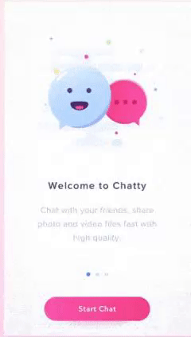

##### Mobile Chat Dashboard


##### Mobile Chat Widget


##### Mobile Rating Conversation


##### Mobile Chat Admin


##### Mobile Annotate Conversations


##### Mobile Application Administration


Source: [PythonGrid](https://pythongrid.com/)

#### Error Message Pages

##### 404 Not Found Page


Source: [Python Flask Tutorial: Full-Featured Web App Part 12 - Custom Error Pages](https://www.youtube.com/watch?v=uVNfQDohYNI)

[Flask Custom Error pages](https://flask.palletsprojects.com/en/1.1.x/patterns/errorpages/)

##### 403 Do Not Have Permission


##### 500 Internal Server


</details>
<br />

#### Computers and Tablets Pages

<details>
<summary>
Computer and Large Devices
</summary>
<p>

##### Chat Welcome Page


##### Chat Dashboard


##### Chat Panel


##### Data Processing and Annotate Conversations


Source: [PythonGRid](https://pythongrid.com/)

##### Application Administration


Source: [PythonGRid](https://pythongrid.com/)

##### Topic Category Values

- Category
- Rating


#### Support pages

##### 404 Not Found Page


##### Contact Us Page Wireframe


Source:
[25 Best Contact Us Page Examples to Inspire Yours (Updated for 2020)](https://www.impactplus.com/blog/best-contact-us-page-examples)

</details>
<br />

## **Application Features**

### Responsive on all device sizes

- Materialize design responsive front-end framework is utilized to build a clean minimalist look and feel.

### Realtime Interactive Chat Form

- A active chat page will be provided to enable messages to be sent between user and moderator

  Source: [MAKE YOUR OWN CHAT ARENA, using flask, socket io in 7 minutes](https://www.linkedin.com/pulse/make-your-own-chat-arenausing-flask-socket-io-7-minutes-suraj-/)

### Private Messaging between Moderator and User

- Private chat session between moderator-user chat for the conversation

  Source: [Flask-SocketIO Session IDs and Private Messages](https://www.youtube.com/watch?v=mX7hPZidPPY)

### Managing Session Data with Flask-Session referencing a MongoDB collection document

- Chat messages will be captured and stored for each conversation

  Source: [Managing Session Data with Flask-Session & Redis](https://hackersandslackers.com/managing-user-session-variables-with-flask-sessions-and-redis/)

### Chat Conversation History will be stored in a database

- Chat conversations will be stored in MongoDB and can be retrieved via direct DB query or custom APIs

  Source: [Adding Chat History to Flask-SocketIO Chat With Flask-SQLAlchemy](https://www.youtube.com/watch?v=pigpDSOBNMc)

### Workbench for Conversation Annotation

- Chat histories in the repository can be viewed and annotated via a chat annotation page

### Application Adminstration

- Conversation Topic Management

### User Role Type Functions

- User account registration for 'user' role type
- Login
- Logout
- Chat Room
- Chat Session

### Navigation Bar Functions by Role Type

- Role type Context Sensitive Navigation Functions

### User Login/Logout Session Management

- Login/Logout session cookie

#### Session Variables

- Session variables used to implement business logic for accessing conversations and moving a conversation through its life cycle workflow

```
session["user"] = username
session["roletype"] = 'user'
session["activeconv"] = str(initconvId)
session["convstatus"] = "active","pending", "done", "annotated"
```

### Persistent Conversation is stored in MongoDB database

Conversations are stored as a collection in MongoDB

### Password Hash

Source: [Werkzeug Security Helpers](https://werkzeug.palletsprojects.com/en/1.0.x/utils/#module-werkzeug.security)

### Defensive Modal Windows and Flash Messages

- Modals will be used to confirm user intent for performing deletes and flask flash messages will be displayed to notify uses of action invoked and completed

Source: [Materialize Css Confirm Delete Popup](https://www.tutorialsplane.com/materialize-css-confirm-delete-popup/)

## Future Enhancements

### Session Reliability and Performance

- Improve reliability and refresh performance by replacing long polling with Flask SocetIO

### CSRF - Cross-Site Request Forgery

- Implement CSRF functionality
  Source: [CSRF Protection in Flask](https://testdriven.io/blog/csrf-flask/)

### Application Functionality

- User can request or perform a password change
- Profile page to include role type
- User comes online will trigger an alert (flash message) to a Moderator
- Moderator who is available will be alerted when a user logins
- Moderator will manually join a conversation or the system will automatically assign and connect the moderator to the user
- Moderators can respond to multiple pending chat on the chat list in separate private sessions
- Application Administrator
  - User Role Type Assignment
  - User registration
  - User Account activation and deactivation
  - Password reset

### REST API for loading training conversations

- Custom API to extract conversations for use to train chatbots or analysis

<details>
<summary>
Reference Sources
</summary>
<p>

- [Building RESTFUL APIs in Flask (Bruce Van Horn)](https://www.linkedin.com/learning/building-restful-apis-with-flask/)
- [Flask JWT secure add endpoint](https://pythonhosted.org/Flask-JWT/)
- [Flask JWT extended](https://pypi.org/project/Flask-JWT-Extended/)
- [Postman](https://www.guru99.com/postman-tutorial.html)
- [Flask MongoAlchemy](https://pythonhosted.org/Flask-MongoAlchemy/)
- [MONGODB RESTFUL API WITH FLASK](https://www.bogotobogo.com/python/MongoDB_PyMongo/python_MongoDB_RESTAPI_with_Flask.php)
</details>
</br>

## Surface Plane

## MongoDB Entities CRUD Operations by Role Type

</br>
Access to application functionality is controlled by the role type associated with the user account. 
</br>

| Entity        | Role Type     | Create | Read | Update | Delete |
| ------------- | ------------- | ------ | ---- | ------ | ------ |
| Users         | User          | Yes    | Yes  | No     | No     | No  |
| Conversations | User          | Yes    | Yes  | Yes    | No     |
| Conversations | Moderator     | No     | Yes  | Yes    | No     |
| Conversations | Annotator     | Yes    | Yes  | Yes    | Yes    |
| Ratings       | Annotator     | No     | Yes  | No     | No     |
| Topic         | Admin         | Yes    | Yes  | Yes    | Yes    |
| Features      | Any Role Type | No     | Yes  | No     | No     |

---

</br>

## UX

The focus of this milestone project is on data. The decision was to apply and adapt the UX Material design, color scheme, look and feel is adapted from the Putting It All Together mini-project. This is necessary to manage the scope of the project.

The Chrome Dev Tool Lighthouse accessibility score is 93 is acceptable for a chat application.

## Application Feature Highlights

The following features use Materialize components that were researched for this application.

## Features and Quick Start Page

Materialize Card Reveal is used for the Features page to inform user based on role the navigation bar item the start performing their role

The user can click activator to reveal detailed how-to instruction for each role type

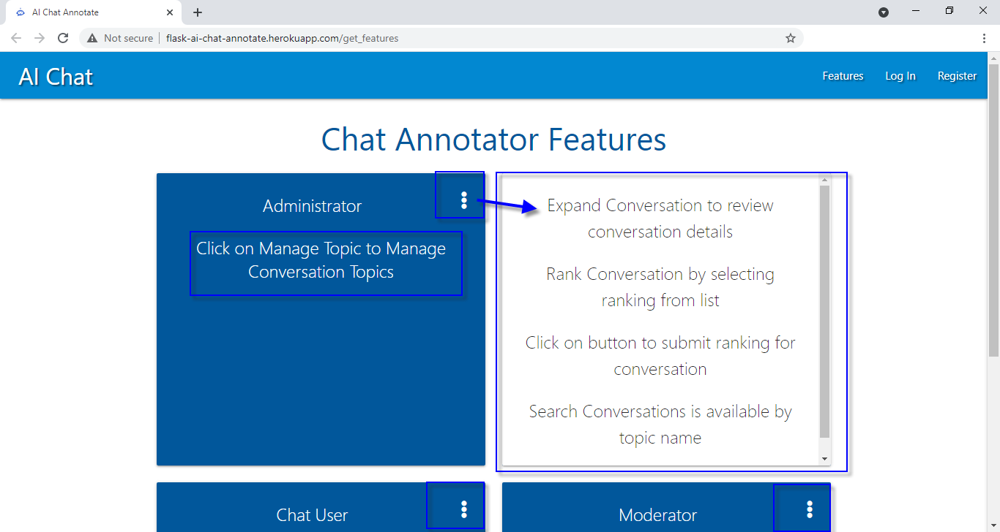

## Active Chat Page

User and moderator engage in real-time conversations and the messages are displayed in the Materialize collections text area

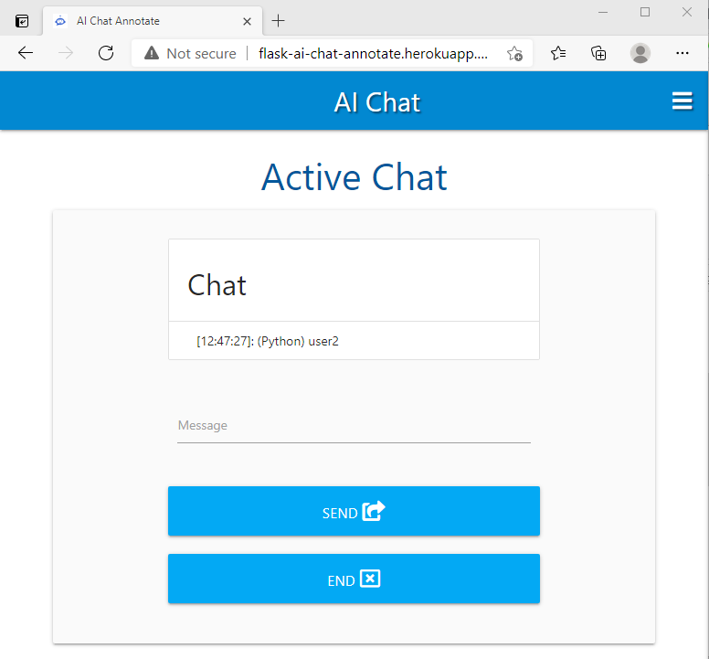

## Chat Application Features

### Menu Bar Items by Role Type

#### User

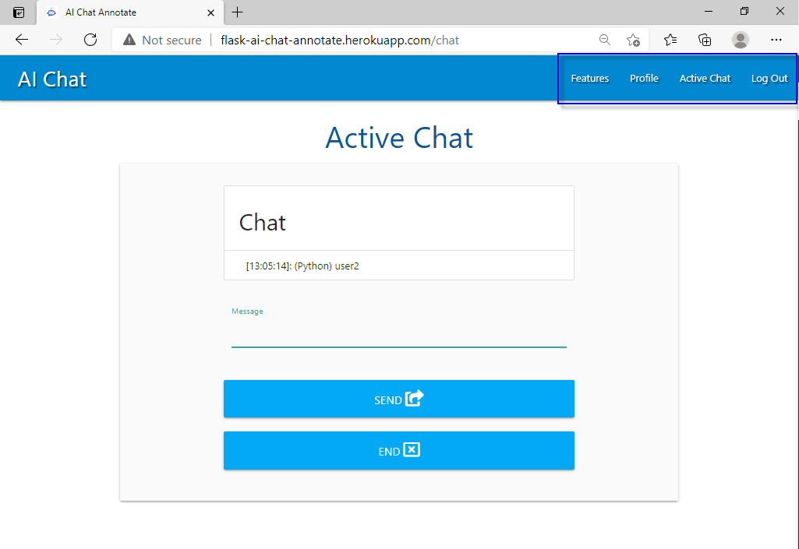

#### Moderator

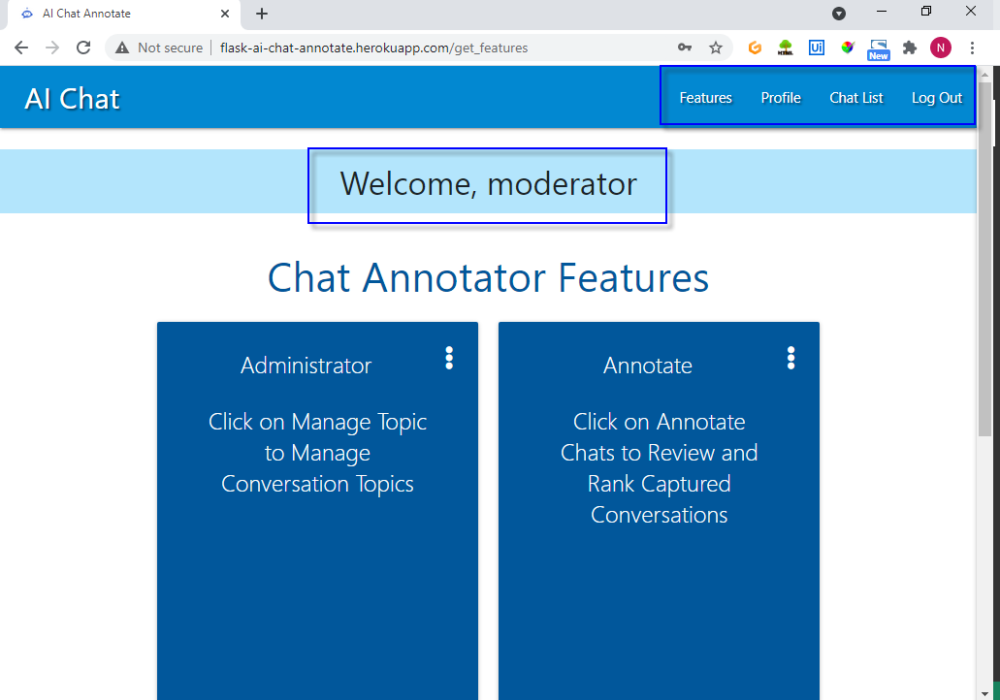

</br>

### Register Account

A user can navigate to the login page via a page link. Once the user successfully logins user is redirected to the user's profile page with a message confirming successful registration

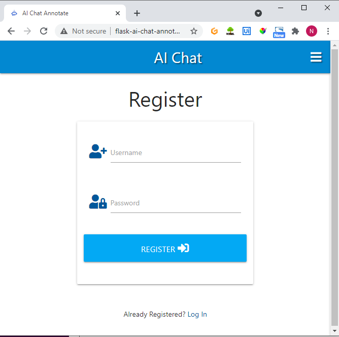

### Logout

User clicks logout on the navigation menu and will be redirected to feature page with Flash message


### Login

User clicks login on the naigation menu and will be redirected to the Login page. There is a page link to Register Account.

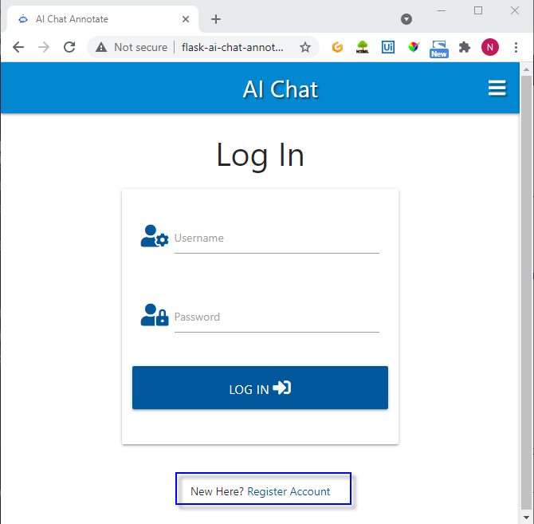

Upon login succesfully the user is redirected to the Features Page with a Flash message welcoming the user


## Active Chat Session

### User Initiate a Conversation

The user selects a topic and initiate a conversation


#### Chat Session for User and Moderator

- Display session Conversation
- Long polling with localstorge and timer to capture and reder input text on refresh
- Session Info: user, random variable, variables
- Enter Message
- End conversation
- End conversation button trigger User Rating Fom(Optional user input)
- Redirect Rating

### Flask Session for Active Chat

- Active chat session is private to the user and moderator engaged in the conversation
- The current limitation is that the application supports one active session at any one time
- When there are multiple active chats do not render correctly to the user and moderator engaged in the conversation
- Private session management is an advanced topic to be addressed in future releases

## Annotation Chat

- Search by Conversation attributes, topic, rating and Status
- Annotate Conversations assign rating and
- Display Conversation
- Rate Conversation
- Delete conversations

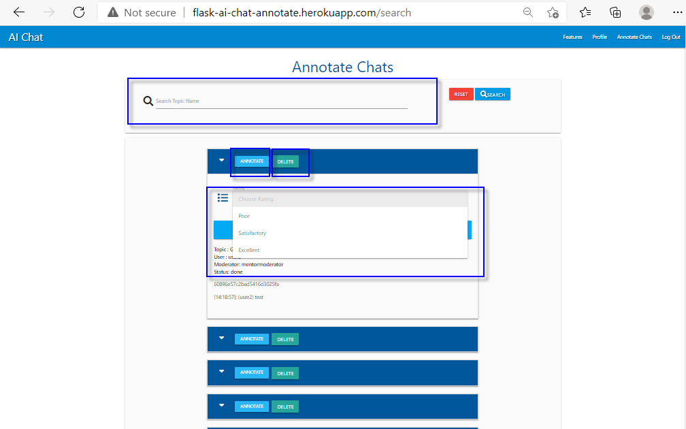

### Topic Management

The manage topic page provides administrator to Add, Edit and Delete topics.

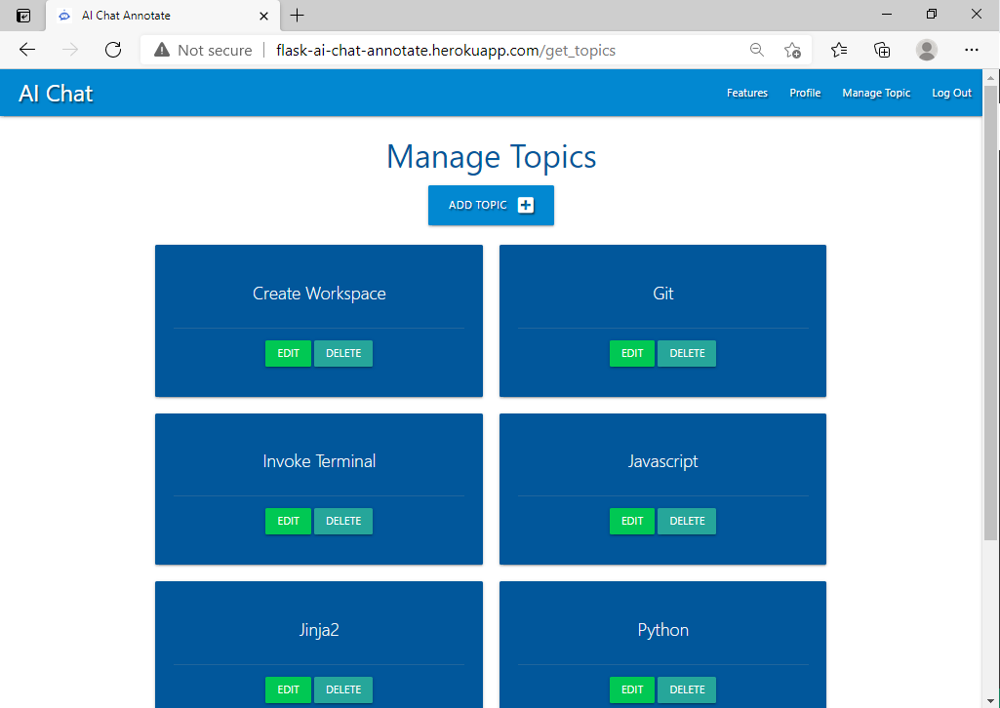

### Seeded Data using Atlas Data Explorer

#### features

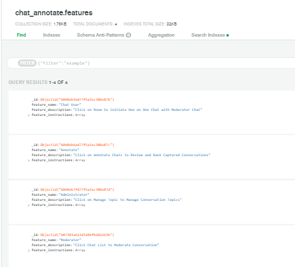

#### ratings

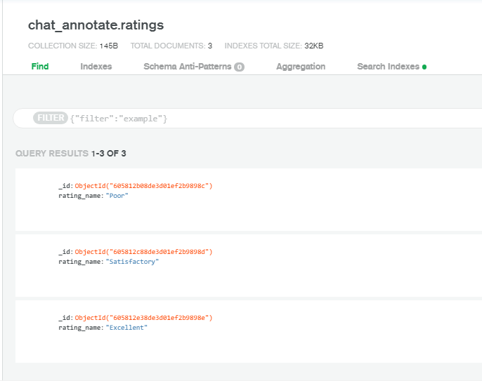

### Conversations MongoDB Index on Topic Name


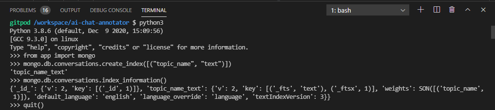

```
from app import mongo

mongo.db.conversations.create_index([("topic_name", "text")])
'topic_name_text'

mongo.db.conversations.index_information()
{'_id_': {'v': 2, 'key': [('_id', 1)]}, 'topic_name_text': {'v': 2, 'key': [('_fts', 'text'), ('_ftsx', 1)], 'weights': SON([('topic_name', 1)]), 'default_language': 'english', 'language_override': 'language', 'textIndexVersion': 3}}

quit()
```

### Chat and Annotation Workflow

| Actor              | Action                                                            | Conversation Status |
| ------------------ | ----------------------------------------------------------------- | ------------------- |
| User               | Select topic and Initiate Conversation                            | pending             |
| System             | Create Conversation in MongoDB                                    | pending             |
| System             | Capture Session Information and conversation Object Id and status | pending             |
| Moderator          | Search pending conversations and respond to a conversation        | active              |
| System             | Conversation status is updated                                    | active              |
| Moderator and User | Engage in active conversation send messages                       | active              |
| System             | Update conversation with messages                                 | active              |
| User or Moderation | End conversation                                                  | done                |
| System             | Update Conversation status                                        | done                |
| System             | Pop session information                                           | done                |
| System             | Moderator redirected to chat List                                 | Not Applicable      |
| System             | User redirected to Chat Room                                      | Not Applicable      |
| Annotator          | Search by topic name, Review, and rate completed conversation     | Annotated           |
| System             | Update conversation to annotated                                  | annotated           |
| Annotator          | Delete done conversation                                          | Not Applicable      |
| System             | Removes conversation from collection                              | Not Applicable      |

---

</br>

### Manage Topic Workflow

</br>

| Actor  | Action                   |
| ------ | ------------------------ |
| Admin  | Add topic                |
| System | Create topic in database |
| Admin  | Update topic             |
| System | Update topic in database |
| Admin  | Delete topic             |
| System | Delete topic in database |

---

</br>

### Templates

| Jinja Templates |
| --------------- |
| base            |
| login           |
| register        |
| profile         |
| features        |
| topics          |
| edit_topic      |
| chatrom         |
| chatlist        |
| chat            |

---

## Error Handling

internal errors are handled gracefully and users are notified of the problem where appropriate.

| Internal Errors    | Error Handlers         |
| ------------------ | ---------------------- |
| page not found     | @app.errorhandler(404) |
| internal server    | @app.errorhandler(500) |
| method not allowed | @app.errorhandler(405) |

---

## Testing

[Testing Documentation here.](TESTING.md)

## Heroku Deployment

HIGH-LEVEL STEPS:

1. Create a Heroku App
2. Connect Git remote
3. Add requirements.txt
4. Add Procfile

<details>
<summary>
Heroku Deployment
</summary>
<p>

#### Create a Heroku Account

- Navigate to Heroku.com
- Click on "Sign Up" and create a new account
- Fill out the form provide a first name, last name, and email address
- Select Python as the Primary Development Language
- Confirm that you are not a Robot
- Click "Create Free Account"
- Heroku will send you a confirmation email
- Copy the link provided in the email and paste it into a new tab
- You will be prompted to set a password
- You may skip selecting if you like to receive occasional updates
- Click "Set Password and Log in"

#### Heroku Dashboard

- Click on Python as the language
- The Heroku Dev center will be rendered
- Click on the browser back button
- Click on "Create New App" button
- Name must not be used by anyone else
- Provide App Name (Note name does not allow space so use hyphens)
- Select region closes to you
- Click on "Create App"

#### Heroku Toolbelt - CLI with gitpod terminal

- Go to your Gitpod project terminal
- Install
  ```
  npm install -g heroku
  ```
- login to Heroku using your account details
  ```
  heroku login -i
  ```
- List heroku apps
  ```
  Apps
  ```
- Rename app and reference it
  (NoteL replace <app name> with the app name)
  ```
  heroku apps:rename <app name> --app <app name>
  ```
- Confirm that your app was successfully renamed
  ```
  Apps
  ```

#### Open App Heroku Dashboard

- Click on "Open App"
- Note the URL for the app is
  ```
  https://APP-NAME.herokuapp.com
  ```

#### Pushing code to Heroku from CLI

- Add a requirements.txt file
  Contains python dependencies

  ```
  pip3 freeze --local > requirements.txt
  git add -a requirements.txt
  git commit -m "Add requirements.txt"
  git push -u heroku main
  ```

- Add a Procfile
  Tells Heroku how to run a project

```
  echo web: python app.py > Procfile
  git add - Procfile
  git commit -m "Add Procfile"
  git push -u heroku main
```

#### Add Heroku Config Vars

- Naviagte to Heroku dashboard
- Click on Settings
  Note: SECRET KEY and KEY string without the quotes in found in env.py file

  ```
  IP 0.0.0.0
  PORT 5000
  SECRET_KEY <copy from env.py>
  KEY <copy from env.py>
  MONGO_URI <copy from env.py>
  MONGO_DBNAME <chat_annotate>
  ```

- Click on "More" and "View Logs"
- Alternatively, select "Restart all Dynos" to restart the app

#### Link GitHub Repository to Heroku for automatic deployment from GitHub

- Navigate to Heroku
- Click on the Deploy tab
- Deployment Method Click Github
- Paste Github repository name and click "Search"(the Github repo name from Github)
- Click on "Connect"
- Click "Enable Automatic Deploys" from the master branch
- Click "Deploy Branch"

#### Push Code from Gitpod

- in Gitpod navigate to the project folder
  ```
  git remote -v
  git status
  git remote rm heroku
  git remote -v
  git status
  git add - A
  git commit -m "Push to GitHub"
  git push origin master
  ```
- Go to Github repo and check that the recent push worked

### Validate Deployment on Heroku

- Navigate to Heroku
- Click on "Deploy Branch
- Click on the "Activity" Tab and "View Build Log"
- Open the app to check that it opens

## Forking the GitHub Repository

By forking the GitHub Repository we make a copy of the original repository on our GitHub account to view and/or make changes without affecting the original repository by using the following steps...

1. Log in to GitHub and locate the [GitHub Repository](https://github.com/)
2. At the top of the Repository (not top of page) just above the "Settings" button on the menu, locate the "Fork" button.
3. You should now have a copy of the original repository in your GitHub account.

### Making a Local Clone

1. Log in to GitHub and locate the [GitHub Repository](https://github.com/)
2. Under the repository name, click "Clone or download".
3. To clone the repository using HTTPS, under "Clone with HTTPS", copy the link.
4. Open Git Bash
5. Change the current working directory to the location where you want the cloned directory to be made.
6. Type `git clone`, and then paste the URL you copied in Step 3.

```
$ git clone https://github.com/YOUR-USERNAME/YOUR-REPOSITORY
```

7. Press Enter. Your local clone will be created.

```
$ git clone https://github.com/YOUR-USERNAME/YOUR-REPOSITORY
> Cloning into `CI-Clone`...
> remote: Counting objects: 10, done.
> remote: Compressing objects: 100% (8/8), done.
> remove: Total 10 (delta 1), reused 10 (delta 1)
> Unpacking objects: 100% (10/10), done.
```

Click [Here](https://help.github.com/en/github/creating-cloning-and-archiving-repositories/cloning-a-repository#cloning-a-repository-to-github-desktop) to retrieve pictures for some of the buttons and more detailed explanations of the above process.

</details>
<br />

## Technologies

### UX

- [Materialize](https://materializecss.com/)
  - Build responsive front-end framework for the application
- [jinja](https://jinja.palletsprojects.com/en/2.11.x/)
  - Build html templates
- [HTML5](https://developer.mozilla.org/en-US/docs/Web/HTML)
- [CSS](https://developer.mozilla.org/en-US/docs/Web/CSS)
- [Font Awesome](https://fontawesome.com/icons?d=gallery&p=2)
  - Icons used for buttons and web pages -[GitHub Wiki TOC generator](https://ecotrust-canada.github.io/markdown-toc/)
  - Used to generate table of contects of README

### Languages Used

- [Python](https://www.python.org/)
  - Code functions and business logic with Flask
- [Javascript](https://developer.mozilla.org/en-US/docs/Web/JavaScript)
  - Polling and localstorage to capture input and refresh pages
  - Initialize Materialize Javascript Components

### Database

- [MongoDB](https://www.mongodb.com/)
  - Document Database to store application data
- [pymongo](https://pypi.org/project/pymongo/)
  - Interact with database
  - Perform CRUD functions

### Frameworks, Libraries & Programs Used

- Flask

  - MVC Modal View Controller framework for developing the application

- [flask-Session](https://flask-session.readthedocs.io/en/latest/)
- [flask-PyMongo](https://flask-pymongo.readthedocs.io/en/latest/)
- [flask-login](https://www.youtube.com/redirect?q=https%3A%2F%2Fflask-login.readthedocs.io%2Fen%2Flatest%2F&v=rrIdQJSKiP4&redir_token=QUFFLUhqbFVhQnc0aHRJN1hodnVQTnVtRWR0dUJFd0pRQXxBQ3Jtc0ttY2xBQWZabHRGbndCM3FDcUwtSXNWVWVEMUgwRUNHb0pVX2lCVkNCc2lqMG40MWF3ZWdibzdkU192UWJKQThUdlplNTJCeVhnbW1ueDJ6bFpBaF92Rm02OElYLVFhWHN2WGtqalVBWFNSS0ZDRm5Zaw%3D%3D&event=video_description)

### Deployment, Source Code Repository, Version Control and Project Management

- [Heroku](https://www.heroku.com/)
  - Deployed application on a Cloud Application Platform
- [GitHub](https://github.com/)
  - Code cloud repository
- [GitHub Projects](https://github.com/features/project-management/)
  - Project Management

### Development Tools

- Chrome DEV Tool
- Firefix Developer Edition
- Gitpod
- Visual Studio Code (VSCode)
- [Balsamiq](https://balsamiq.com/)
  - Create Wireframes
- [SnagIt](https://www.techsmith.com/screen-capture.html)
  - Screen Capture for document images
- [Markdown](https://guides.github.com/features/mastering-markdown/)
  - Create git documents
- Microsoft Edge

### Validators

- [CSS Beautifier](https://www.freeformatter.com/css-beautifier.html)
- [WCAG Color contrast checker](https://chrome.google.com/webstore/detail/wcag-color-contrast-check/plnahcmalebffmaghcpcmpaciebdhgdf?hl=en)
- [Responsive Design Checker](http://ami.responsivedesign.is/)
- Chrome Dev Tool
  - JS loaded using dev tool/network
- [Jshint](https://jshint.com/)

### Accessibility Audit

- Chrome Dev Tool
  - Ligthouse Accessibility

## Content Credits

- All content and data were created by the developer

## Media

- [Dreamstime chatbot icon](https://thumbs.dreamstime.com/b/chatbot-icon-virtual-assistant-vector-143083940.jpg)
- All images were created by the developer

## Tutorial References

<br />
<details>
<summary>
Tutorials
</summary>
<p>

- [Build a Simple CRUD App with Python, Flask, and React](https://developer.okta.com/blog/2018/12/20/crud-app-with-python-flask-react)
- [Node.js: Real-Time Web with Socket.IO](https://www.lynda.com/Node-js-tutorials/Course-prerequisites/633868/685558-4.html?srchtrk=index%3a14%0alinktypeid%3a2%0aq%3aflask_socketio%0apage%3a1%0as%3arelevance%0asa%3atrue%0aproducttypeid%3a2)
- [Building your first Chat Application using Flask in 7 minutes](https://codeburst.io/building-your-first-chat-application-using-flask-in-7-minutes-f98de4adfa5d)
- [Simple boilerplate for ChatterBot using Flask](https://xscode.com/chamkank/flask-chatterbot)
- [Python Chat Bot Tutorial - Chatbot with Deep Learning (Part 1)](https://www.youtube.com/watch?v=wypVcNIH6D4https://www.youtube.com/watch?v=wypVcNIH6D4)
- [Livechat Bot Transfer users from a bot to a live agent](https://www.appypie.com/chatbot/livechat-bot)
- [Creating a Discord Bot from Scratch and Connecting to MongoDB](https://towardsdatascience.com/creating-a-discord-bot-from-scratch-and-connecting-to-mongodb-828ad1c7c22e)
- [How To Make A Chatbot In Python?](https://www.edureka.co/blog/how-to-make-a-chatbot-in-python/)
- [1.1: fetch() - Working With Data & APIs in JavaScript](https://www.youtube.com/watch?v=tc8DU14qX6I&feature=youtu.be)
- [How to use Fetch with JavaScript](https://www.youtube.com/watch?v=tVQgfKqbX3M&feature=youtu.be)
- [JavaScript this Keyword Explained In 3 Minutes](https://www.youtube.com/watch?v=Pi3QC_fVaD0)
- [JavaScript Promise in 100 Seconds](https://www.youtube.com/watch?v=RvYYCGs45L4)
- [Intro To JavaScript Unit Testing & BDD (2 Hour+ Course)](https://www.youtube.com/watch?v=u5cLK1UrFyQ&feature=youtu.be)
- [Awesome Python Awesome A curated list of awesome Python frameworks, libraries, software and resources.](https://awesome-python.com/)

</details>
<br />

## References

<br />

<details>
<summary>
References
</summary>
<p>

- [ChatterBot](https://chatterbot.readthedocs.io/en/stable/)

- [The MongoDB 4.2 Manual](https://docs.mongodb.com/v4.2/)

- [Lets Build an Intelligent Chatbot](https://www.kdnuggets.com/2019/12/build-intelligent-chatbot.html)

#### Database schema

- [Data Model Design](https://docs.mongodb.com/manual/core/data-model-design/)
- [Operational Factors and Data Models](https://docs.mongodb.com/manual/core/data-model-operations/)
- [Model Data for Atomic Operations Pattern](https://docs.mongodb.com/manual/tutorial/model-data-for-atomic-operations/#data-modeling-atomic-operation)
- [MongoEngine](http://docs.mongoengine.org/tutorial.html)

#### MONGODB CRUD

- [Transactions and Operations](https://docs.mongodb.com/manual/core/transactions-operations/#transactions-operations-crud)
- [Query an Array](https://docs.mongodb.com/manual/tutorial/query-arrays/#read-operations-arrays)
- [Query on Embedded/Nested Documents](https://docs.mongodb.com/manual/tutorial/query-embedded-documents/#read-operations-embedded-documents)
- [Model Data to Support Keyword Search](https://docs.mongodb.com/manual/tutorial/model-data-for-keyword-search/)

#### SocketIO

- [Polling vs WebSockets vs Socket.IO (Simple Explanation) - Chat App Part11](https://www.youtube.com/watch?v=sUEq35F-ELY)
- [Create Chat Applicaton Using Flask-SocketIO - Chat App Part12](https://www.youtube.com/watch?v=zQDzNNt6xd4)
- [Node.js:Real-Time Web Socket.IO](https://www.lynda.com/Node-js-tutorials/Node-js-Real-Time-Web-Socket-IO/633868-2.html)

#### Flask-Login

- [Flask-login](https://flask-login.readthedocs.io/en/latest/)

#### Flask-Session

- [Flask-Session](https://flask-session.readthedocs.io/en/latest/#version-0-4)
- [AJAX](https://developer.mozilla.org/en-US/docs/Web/Guide/AJAX)
  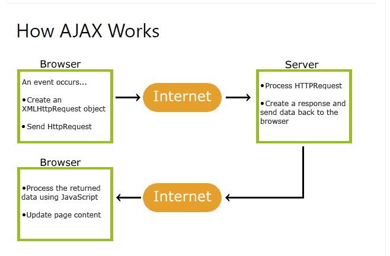
- [AJAX Introduction](https://www.w3schools.com/xml/ajax_intro.asp)

#### Documentation

- [Demo your App in your GitHub README with an Animated GIF](https://dev.to/kelli/demo-your-app-in-your-github-readme-with-an-animated-gif-2o3c)

- [How to use JSDoc - Basics & Introduction](https://www.youtube.com/watch?v=Nqv6UkTROak)
- [Code Institue Sample ReadMe](https://github.com/Code-Institute-Solutions/SampleREADME)

#### UX

- [Chatbot Design](https://dribbble.com/tags/chatbot?page=19&s=latest)
- [8 beautiful chatbot UI examples that will definitely inspire you](https://www.digital22.com/insights/beautiful-chatbot-ui-examples-that-will-definitely-inspire-you#a6)

##### UX Sources Credits

- CI Mini Project - Putting It All Together
- [Chat UI Welcome Screen from Vlad Tyzum](https://www.digital22.com/insights/beautiful-chatbot-ui-examples-that-will-definitely-inspire-you#a6)
- [Dashboard and Chat](https://dribbble.com/shots/10978875-Insurance-app-dashboard-Chat)
- [Direct Messaging](https://dribbble.com/shots/10831579-013-Direct-Messaging-UI-Challenge)

##### Alternate UX Sources

- [Chatbot](https://dribbble.com/shots/10997646-Chatbot-for-US-police-departments)
- [Create Chat Bots](https://dribbble.com/shots/10810904-Chat-Bots)
- [Corporate Chat Widget](https://dribbble.com/shots/10770064-Corporate-chat-widget)

</details>
<br />

## Credits

- Mentor Guido Cecilio for his feedback and guidance on proper session handling, code refactoring, and defensive programming
- Claire Lally who conviced me that Flask-session is achievable and I believed her followed by an eventful MS3 learning journey
- Tutor Tim Nelson over and beyond for guidance and technical support and encouragement to take on the daunting code challenges
- Fellow learner Mihaela Sandrea who took the time to provide user acceptance feedback and testing
- Slack community members who provided support to survive the learning journey

## Disclaimer

This project is for educational use only
