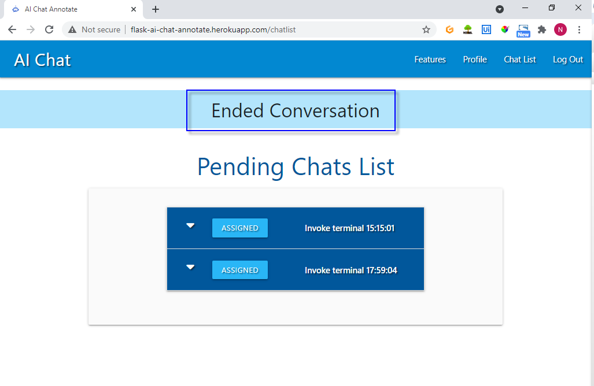
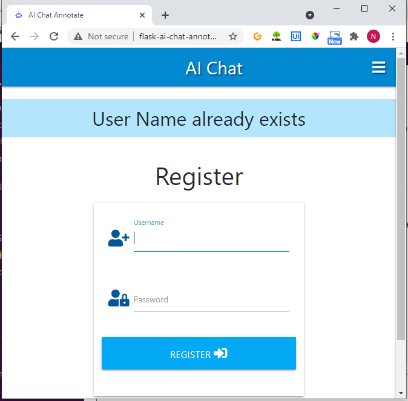

# Chat Annotator Testing

**Important Testing Notes**

- To test the chat functionality it will be necessary to use different browsers and/or different devices when logged in as a persona (Chrome/Firefox/Edge). The reason is that it utilizes sessions
- After a user or moderator log out any active chat session cannot be resumed in subsequent login. This is a known limitation for the initial release of the application.
- Registration of user account is only for role type user.
- To create accounts as moderator, admin, and annotator register as you would as a user. Provide me with the username and the role type and I will have to update it directly using MongoDB data explorer

## General Scenario

- Conversations are one moderator to one user
- Each User and Moderator can only engage in one active conversation at any time.
- The conversations are initiated by the user and once a session is ended it cannot be continued
- The user or moderator will be able to continue conversations if the browser session is not deleted.
- A moderator login and can review and respond to a chat that is pending a response
- User can engage in a real-time conversation with the moderator
- Annotator will review and rate completed conversations

## Contents

[Chat Annotator Testing](#chat-annotator-testing)

- [General Scenario](#general-scenario)
- [End to End Chat Session Test Matrix](#end-to-end-chat-session-test-matrix)
- [Functional User Stories Role Type Test Matrix](#functional-user-stories-role-type-test-matrix)
- [Route Redirects and Internal Errors](#route-redirects-and-internal-errors)
- [Validate Page Links](#validate-page-links)
- [Responsiveness](#responsiveness)
- [Unit Testing](#unit-testing)
- [Known Issues](#known-issues)
- [Code Refactoring](#code-refactoring)
- [Validators](#validators)
- [Browsers and Devices](#Browsers-and-Devices)

</br>

## End to End Chat Session Test Matrix

| Test Case | Test Case                    | User Story                                                                                                               | Feature      | Expected Result                                                                                                                                                                                                                                                                  | Actual Result |
| --------- | ---------------------------- | ------------------------------------------------------------------------------------------------------------------------ | ------------ | -------------------------------------------------------------------------------------------------------------------------------------------------------------------------------------------------------------------------------------------------------------------------------- | ------------- |
| 1.1       | Chat Features                | As a user, I want to know how to start using the application                                                             | Feature Page | Direct user to quick start link by role type , Card panels provide quick-start info and when clicked provides more details on what each feature does                                                                                                                             | Pass          |
| 1.2       | Initiate Conversation        | As a user, I want to select a topic and initiate a conversation                                                          | Chat Room    | Click on Chat Room on the menu, Renders page for the user to select a topic and click start chat. User is redirected to Active chat page with a flash message that conversation is pending Moderator's response                                                                  | Pass          |
| 1.2.1     | Review Pending Chats         | As a Moderation, I want to be able to view the list of chats that are pending a moderator to respond                     | Chat List    | Moderator click on Chat List on Navigation Menu, redirect to the chat list and renders the list of Pending Chats are labeled "RESPOND"                                                                                                                                           | Pass          |
| 1.2.2     | Review Active Chats          | As a Moderator, I want to be able to view a list of chats that are currently assigned to other moderators                | Active Chat  | Moderator clicks on Chat List on Navigation Menu, redirect to chatlist. Active Chats are labeled "ASSIGNED"                                                                                                                                                                      | Pass          |
| 1.2.3     | Respond to Chat              | As a Moderator, I want to be able to conduct one active conversation session one at any time                             | Active Chat  | Moderator Click on Respond and is redirected to Active Chat Page with Flash message "Moderator Responded"                                                                                                                                                                        | Pass          |
| 1.3       | Send message                 | As a user, I want to be able to send a message during an active conversation                                             | Active Chat  | User input message in the text area and send button captures message entered by the user. The message entered by the user will appear in the display text area with a timestamp. Page refresh and displays all messages entered by the user or moderator of the conversation     | Pass          |
| 1.3.1     | Send Message                 | As a Moderator, I want to be able to respond to questions from a user in real-time to assist the user                    | Active Chat  | Moderator message in the text area and send button captures message entered by the moderator. The message entered by the user will appear in the display text area with a timestamp. Page refresh and displays all messages entered by the user or moderator of the conversation | Pass          |
| 1.4       | End Conversation             | As a user, I want to end the conversation                                                                                | Active Chat  | The user clicks on the end button. User will be redirected to Chat Room. Flash message render to confirm conversation has ended User is redirected to chat room                                                                                                                  | Pass          |
| 1.4.1     | End Conversation             | As a Moderator, I want to be able to terminate a conversation session to indicate completion of the conversation session | Active Chat  | The Modearator clicks on the "END" button. The moderator will be redirected to Chat Room. Flash message render to confirm conversation has ended User is redirected to Chat List                                                                                                 | Pass          |
| 1.5       | User sees moderator response | As a user, I want to be able to see moderator responses as they are entered in real-time                                 | Active Chat  | Messages entered by the moderator will be displayed in the active chat message area. Messages are displayed when entered in real-time. Page refresh with messages displayed when no keys are pressed                                                                             | Pass          |
| 1.6       | User Initiate Chat           | As a User, I want to be able to handle one active session at any time                                                    | Chat Room    | When a user initiates a conversation user is redirected from the chat room to the active chat page The user selects a topic and is directed to active chat page                                                                                                                  | Pass          |
| 1.7       | Logout                       | As a user, I want to be able to logout                                                                                   | Logout       | User clicks on Logout on navigation menu. Successful logout. User is redirected to features page with Flash Message "You have been logged out" and redirected to Login                                                                                                           | Pass          |

---

</br>

<details>
<summary>
Test Case Screen Capture
</summary>
<p>
### 1.2 Initiate Chat


### 1.2.1 Pending Chats


### 1.2.3 Moderator Respond


### 1.3 User Send Message


### 1.3.1 Moderator Send Message


### 1.4 User Ends Conversation


### 1.4.1 Moderator End Conversation



### 1.7 Logout


</details>

## Functional User Stories Role Type Test Matrix

| Test Case | User                                                                                 | Feature                                  | Expected Result                                                                                                                                                                       | Actual Result |
| --------- | ------------------------------------------------------------------------------------ | ---------------------------------------- | ------------------------------------------------------------------------------------------------------------------------------------------------------------------------------------- | ------------- |
| 2.1       | As a user, I want to register a user account                                         | Register Account                         | Directed to User with access to user navbar functions                                                                                                                                 | Pass          |
| 2.2       | As a returning user, I can login using credentials used to register a user account   | Successful Login                         | Login with credentials. Redirected to Features Page with Flash "Welcome username"                                                                                                     | Pass          |
| 2.3       | As a user, I want to be notified when I use the incorrect credentials at login       | User entered incorrect login credentials | User is informed of incorrect credentials, Flash message "Incorrect Username and/or Password" stays on login page                                                                     | Pass          |
| 2.4       | As a new user, I want to be notified if user name already exists during registration | Username exists                          | User registers using a username that is not in the database, User register with a name that already exists in the database. Flash message "User Name already exists" on register page | Pass          |
| 2.5       | As a user, I want to be notified when registration is successful                     | Registers with valid credentials         | User register using a name that is not in the database, Redirected to the users' Profile page with a flash message "Registration Successful"                                          | Pass          |

---

</br>

2.2 Returning User Successful Login


2.4 User Name already exists during registration



2.5 User Registration Successful


</br>

### Chat Conversation Annotator

- Review and Rate Conversations

| Test Case | User Story                                                                       | Feature                      | Expected Result                                                                                                                                                      | Actual Result |
| --------- | -------------------------------------------------------------------------------- | ---------------------------- | -------------------------------------------------------------------------------------------------------------------------------------------------------------------- | ------------- |
| 3.1       | As an Annotator I want to view a list of conversations that need to be annotated | Review Chat list             | Pass                                                                                                                                                                 | Pass          |
| 3.2       | As an Annotator, I want to be able to search conversations by topic name         | Search Conversations         | Enter a text string to get conversations with the string found in the topic name. List of conversations with the search string found in the topic name be rendered   | Pass          |
| 3.3       | As an Annotator, I want to be able to search conversations by topic name         | Reset Search String          | Click the "Reset" button to clear search string input. Input text screen is removed                                                                                  | Pass          |
| 3.4       | As an Annotator, I want to be able to review and rate conversation               | Review and Rate Conversation | Click to expand accordion for conversation to review details, select a rating and click update. Page renders and the conversation annotated is removed from the list | Pass          |

---

</br>

3.1 View Annotate Chat List

3.2 Search Annotate Chat List by Topic Name
3.3 Annotate chat by selecting a Rating

3.4 Review and Rate Conversation


### Conversation Topic Management

| Test Case | User Story                                     | Feature      | Expected Result                                                                                                                                                                                                                                                                                                                                     | Actual Result |
| --------- | ---------------------------------------------- | ------------ | --------------------------------------------------------------------------------------------------------------------------------------------------------------------------------------------------------------------------------------------------------------------------------------------------------------------------------------------------- | ------------- |
| 4.1       | As an Administrator, I want to add a new topic | Add Topic    | The administrator clicks on the Add Topic button to redirect to the Add Topic page. Input the topic name and click Add Topic button. The Administrator is redirected to the Manage Topic page with a flash message "New Topic Added"                                                                                                                | Pass          |
| 4.2       | As an Administrator, I want to edit topic      | Edit Topic   | The administrator clicks on the Edit button for the card with the Topic name. A modal is rendered with the current topic name. User edits the topic name and clicks Save. The administrator is redirected to the topics page and the edited topic name will be displayed and replaces the old name                                                  | Pass          |
| 4.3       | As an Administrator, I want to delete topic    | Delete Topic | The administrator clicks on the Delete button for the card with the Topic name to delete. A modal is rendered to confirm deletion or cancel. Click on delete and the administrator is redirected to the Manage Topic page with a Flash message "Topic Successfully Deleted" and the card with the deleted Topic name no longer displays on the page | Pass          |

---

</br>


4.1 Add Topic


4.2 Edit Topic


4.3 Delete Topic


## Confirmations before deletes

## Route Redirects and Internal Errors

| Test Case                               | Expected                       | Actual                                                         |
| --------------------------------------- | ------------------------------ | -------------------------------------------------------------- | -------------------------------------------------------------- |
| Unauthorised acces to chat conversation | /chat/608483da12743097778c99e2 | 404                                                            | 404.html rendered                                              |
| Unauthorised acces to chat              | /chat                          | 404                                                            | flash "You are currently not logged in" redirected to features |
| User not logged in chat                 | /chat                          | flash "You are currently not logged in" redirected to features |
| User not logged in chat room            | /chatroom                      | flash "You are currently not logged in" redirected to features |
| User not logged in chat list            | /chatlist                      | flash "You are currently not logged in" redirected to features |
| User not logged in annotate chats       | /annotatechats                 | flash "You are currently not logged in" redirected to features |
| User not logged in annotate chat id     | /annotatechats/convid          | flash "You are currently not logged in" redirected to features |
| User not logged in logout               | /logout                        | flash "You are currently not logged in" redirected to features |
| User not logged in profile              | /profile                       | flash "You are currently not logged in" redirected to features |
| User not logged in get topics           | /get_topics                    | flash "You are currently not logged in" redirected to features |
| User not logged in add topics           | /add_topics                    | flash "You are currently not logged in" redirected to features |
| User not logged in edit topics          | /edit_topics                   | flash "You are currently not logged in" redirected to features |
| User not logged in edit topics id       | /edit_topics/"topicid"         | flash "You are currently not logged in" redirected to features |
| User not logged in delete topics id     | /delete_topic/"topicid"        | flash "You are currently not logged in" redirected to features |
| User not logged in search               | /search                        | flash "You are currently not logged in" redirected to features |
| User not logged in search               | /delchat/delconvid"            | flash "You are currently not logged in" redirected to features |

---

</br>

## Validate Page Links

| Page     | Page Link | Expected Result         | Actual Result |
| -------- | --------- | ----------------------- | ------------- |
| Register | Log In    | Redirects to Login Page | Pass          |

## Responsiveness

| Test Case | Media Size | Component            | Expected Result             | Actual Result |
| --------- | ---------- | -------------------- | --------------------------- | ------------- |
| R1        | Medium     | Navigation Menu Icon | Menu Icon invokes Side Menu | Pass          |
| R2        | Medimu     | Side Navigation Menu | Menu Icon invokes Side Menu | Pass          |

---

</br>

### R1 Navigation Menu Icon


### R2 Side Navigation Menu


# Unit Testing

Here are highlights of issues encountered during unit testing in code development that were researched and resolved.

## Unable to trigger a POST to perform an update

Issue: Unable to perform an update to set the status of a conversation record using a select and button

```
An invalid form control with name='rating_name' is not focusable.
```

Resolution:
Remove the required attribute from the select for rating list

```
<select id="rating_name" name="rating_name" class="validate" required>

<select id="rating_name" name="rating_name" class="validate" >
```

## Collapsible Accordian

Records are displayed using a materialize collapsible accordion each with a select list and button. The id of the first record is being picked up instead of the record selected for updated

Issue: The first conversation displayed is being updated instead of the one selected by the user

Resolution:
Placement of the form end tag needs to be inside within the jinja for loop

Source: [How To Fix: An invalid form control with name=’x’ is not focusable error](https://www.geekinsta.com/how-to-fix-an-invalid-form-control-with-name-is-not-focusable/)

## MongoDB find_one_and_update syntax to combine $set and $push

Issue: Unable to combine into one

```
            # insert final message of conversation
            mongo.db.conversations.find_one_and_update(
                {"_id": ObjectId(session["activeconv"])},
                {"$push": {"msg": {"timestamp": msgtime,
                                   "username": session["user"],
                                   "msgtxt": request.form.get("msgtxt")}}})

            mongo.db.conversations.find_one_and_update(
                {"_id": ObjectId(session["activeconv"])},
                {"$set": {"status": "done"}})
```

Error:

```
pymongo.errors.OperationFailure
pymongo.errors.OperationFailure: Unrecognized pipeline stage name: '$push', full error: {'operationTime': Timestamp(1618923014, 1), 'ok': 0.0, 'errmsg': "Unrecognized pipeline stage name: '$push'", 'code': 40324, 'codeName': 'Location40324', '$clusterTime': {'clusterTime': Timestamp(1618923014, 1), 'signature': {'hash': b'\x06\xa4\xae\x81\xbc\xfd\x9c\xb4\\\x13\xaaf\x05:\xaf\xb9\xf9}\x99`', 'keyId': 6917341148591685635}}}
```

Resolved:

```
            # capture message text and set status
            mongo.db.conversations.find_one_and_update(
                {"_id": ObjectId(session["activeconv"])},
                {"$push": {"msg": {"timestamp": msgtime,
                                   "username": session["user"],
                                   "msgtxt": request.form.get("msgtxt")}},
                 "$set": {"status": "done"}})

```

Source: [How do I set and push in a single update with MongoDB?](https://www.tutorialspoint.com/how-do-i-set-and-push-in-single-update-with-mongodb)

## Secure chat URL access to authorized moderator and user

Issue: Unauthorized moderator can access active conversation by using the URL initiated by a user

Fix: Validate if a moderator has an active chat session and authorized access to conversation

```
            # if moderator has an active chat session for active conversation
            if ('convstatus' in session) and (
                    session['convstatus'] == "active") and (
                        'activconv' in session):
```

## Polling removes message text if on key-down pressed and timeout are delayed

Message entered by User if Send is not clicked and there are no key-down events detected within a few seconds it will be lost

Issue: Limitation of Polling with the key-down event time limit

Fix: Created a custom function setPageReload to store the entered text in localstorage with a set timeout to rerender the text on refresh

## Active chat sessions lose association with the user

Active chat session of a different user is rendered when there are multiple active chat session at any one time

Issue: Active chat session is not properly tied to the user and moderator engaging in the conversation

Fix: Use AJAX for session management and chat filtering to the user and moderator of an active chat

</br>

# Known Issues

These are known issues that are to be resolved in future releases of the application

## Most but not all scenarios where URL are modified to access conversation using ObjectId

Issue: Knowledge of how to handle Route validation is not sufficient to code for all scenarios.

## A new browser session is required to engage in a conversation

Issue: If a browser back button is pressed it renders the previous page is not removed and different user access the application it will display page information from the previous session

Future Enhancement:
Implement a solution is to use SocketIO

## Browser back button during chat renders the previous page before refreshed by polling

Issue: If a browser back button is pressed on the chat page after entering a message it rerenders message that was previously entered


## Topic Search for some words does not render No result found exception

Issue: The word python does not render the message "No Results Found" message

Attempts to fix error:

- Use strip() to remove trailings spaces

```
    query = request.form.get("query")
    conversations = list(mongo.db.conversations.find(
        {"$text": {"$search": query}}))

```

## Moderator accessing Done conversation error in the same session after completing the conversation. This issue is not consistent and hard to replicate

Issue: Monderator using url to a conversation that is done renders a KeyError: 'activeconv'


## Active Conversations Not Accessible if Browser Session is no longer available

Issue: If the browser session information is deleted there is currently no function available
to track and enable users to access and continue the conversation

Enhancement for Future Release:
Replace session and polling with Flask-Socket IO or custom functions to remove dependency on session

## Custom text capture input during page reloads results in page jumps

Issue: During message text input the page refresh the page jumps and the position of the page components changes momentarily.

The results in the invoking buttons that are not intentional while entering message text.

This issue is especially disruptive on smaller devices.

Future Enhancement:
Fine-tune the refresh timing duration and improve the custom function

## Moderators can only handle a response to pending chat that is listed last

Issue: When there is more than one pending conversation in the chat list moderators can only respond to the last pending chat listed. If a moderator responds to chats listed other than the last one it will throw a 404 error.

This is related to the improper implementation of private sessions which is an advanced topic to be addressed in future releases

Future Enhancement:
Need to determine how to secure sessions to render to the user and moderators engaged in the active conversation.

## Active Sessions cannot be resumed after logging out.

Issue: Session information is not preserved for active conversations on logout.

Future Enhancement:
Need to implement a solution to store and resume active conversations

<br>

## Code Refactoring

**Note: Acknowledgement and credit goes to Mentor Guido Cecilio who provided recommendations, guidance, and concrete examples for code refactoring**

### Use len() function instead of For Loop

initconvId = conversations[len(conversations)-1]['_id']
for conversation in conversations:
initconvId = conversation['_id']
Source: Python len() Function

#### Input Validation

- Edit_topic decorator function does not handle invalid ObjectId

Issue: Invalid ObjectId renders bson-errors.invalidis
Resolution:
bson.objectid.ObjectId.is_valid('54f0e5aa313f5d824680d6c9')
=> True
bson.objectid.ObjectId.is_valid('54f0e5aa313f5d824680d')
=> False


Source: [How to check that mongo ObjectID is valid in python?](https://stackoverflow.com/questions/28774526/how-to-check-that-mongo-objectid-is-valid-in-python)

# Validators

## DevTool Lighthouse


## Python


[PEP8](http://pep8online.com/)

## Javascript


[JSHint Configured for New JavaScript features (ES6)](https://jshint.com/)

## CSS


[CSS Validation Service](https://jigsaw.w3.org/css-validator/#validate_by_input)
[Autoprefixer is a PostCSS plugin which parses your CSS and adds vendor prefixes](https://autoprefixer.github.io/)

### HTML Validator


[HTML Validtor](https://validator.w3.org/)

## Accessibility

- Accessible color palette builder(https://toolness.github.io/accessible-color-matrix/)


## Responsive Web Page


[Ami Responsive Checker](http://ami.responsivedesign.is/)

# Browsers and Devices

## Browsers

- Google Chrome
- Microsoft Edge

## Devices

- Samsung Galaxy S7
- Lenovo TB-X304F Android version 7.1.1

## PC

- Acer Aspire A317
- Lenovo L421
