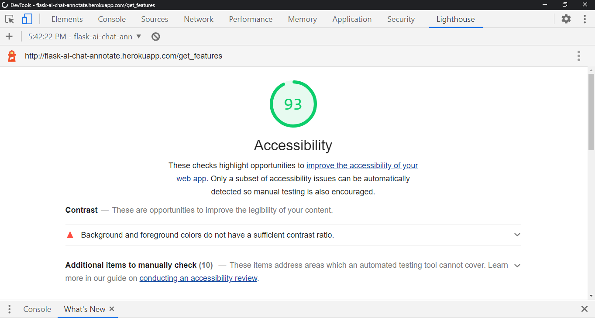

## End to End Testing

**Important Testing Notes**

- To test the chat functionality it will be necessary to use different browsers and/or different devices when logged in as a persona (Chrome/Firefox/Edge). The reason is that it utilizes flask session
- Avoid clearing browser cache so that sessions remain active for returning users. Clearing browser cache may be necessary to start over active chat sessions. This is a known limitation for the initial release of the application.
- Registration of user account is only for role type user.
- To create accounts as moderator, admin, and annotator register as you would as a user. Provide me with the username and the role type and I will have to update it directly using MongoDB data explorer

## General Scenario

- Conversations are one moderator to one user
- Each User and Moderator can only engage in one active conversation at any time.
- The conversations are initiated by the user and once a session is ended it cannot be continued
- The user or moderator will be able to continue conversations if the browser session is not deleted.
- A moderator login and can review and respond to chats that are pending a response
- User can engage in a real-time conversation with the moderator
- Annotator will review and rate completed conversations

## Contents

- [End to End Testing](#end-to-end-testing)
- [General Scenario](#general-scenario)
- [Contents](#contents)
- [End to End Chat Session Test Matrix](#end-to-end-chat-session-test-matrix)
- [Functional User Stories Role Type Test Matrix](#functional-user-stories-role-type-test-matrix)
- [Confirmations before deletes](#confirmations-before-deletes)
- [Route Redirects and Internal Errors](#route-redirects-and-internal-errors)
- [Validate Page Links](#validate-page-links)
- [Responsiveness](#responsiveness)

* [Unit Testing](#unit-testing)
  - [Unable to trigger a POST to perform an update](#unable-to-trigger-a-post-to-perform-an-update)
  - [Collapsible Accordian](#collapsible-accordian)
  - [MongoDB find_one_and_update syntax to combine $set and $push](#mongodb-find-one-and-update-syntax-to-combine--set-and--push)
  - [Unsecure chat url to unathorized conversation by moderator and user](#unsecure-chat-url-to-unathorized-conversation-by-moderator-and-user)
  - [Chat Interface](#chat-interface)
* [Known Issues](#known-issues)
  - [Code Refactoring](#code-refactoring)
* [Validators](#validators)

## End to End Chat Session Test Matrix

| Test Case # | Test Case                                                                                                 | User Story                                                                                                               | Feature                                                                             | Expected Result                                                                              | Actual Result                                                                                                 |
| ----------- | --------------------------------------------------------------------------------------------------------- | ------------------------------------------------------------------------------------------------------------------------ | ----------------------------------------------------------------------------------- | -------------------------------------------------------------------------------------------- | ------------------------------------------------------------------------------------------------------------- |
| 1.1         | Chat Features                                                                                             | As a user, I want to know how to start using the application                                                             | Feature Page                                                                        | Direct user to quick start link by role type                                                 | Card panels provide quick- start info and when clicked provides more details on what each feature does        |
| 1.2         | Initiate Conversation                                                                                     | As a user, I want to select a topic and initiate a conversation                                                          | Click on Room Link                                                                  | Renders Page for user to select topic and click start chat                                   | User is redirected to Active chat page with a flash message that conversation is pending Moderator's response |
| 1.2.1       | As a Moderation, I want to be able to view the list of chats that are pending a moderator to respond      |
| 1.2.2       | As a Moderator, I want to be able to view a list of chats that are currently assigned to other moderators |
| 1.2.3       | As a Moderator, I want to be able to conduct one active conversation session one at any time              |
| 1.3         | Send message                                                                                              | As a user, I want to be able to send a message during an active conversation                                             | Message text area and send button captures message entered by user                  | The message entered by the user will appear in the display text area with a timestamp        | Page refresh and displays all messages entered by the user or moderator of the conversation                   |
| 1.3.1       |                                                                                                           | As a Moderator, I want to be able to respond to questions from a user in real-time to assist the user                    |
| 1.4         | End Conversation                                                                                          | As a user, I want to end the conversation                                                                                | Use clicks on the end button                                                        | User will be redirected to Chat Room. Flash message render to confirm conversation has ended | User is redirected to chat room                                                                               |
| 1.4.1       |                                                                                                           | As a Moderator, I want to be able to terminate a conversation session to indicate completion of the conversation session |
| 1.5         | User sees moderator response                                                                              | As a user, I want to be able to see moderator responses as they are entered in real-timee                                | Messages entered by the moderator will be displayed in the active chat message area | Messages are displayed when entered in real-time                                             | Page refresh with messages deisplayed when no keys are pressed                                                |
| 1.6         | As a User, I want to be able to handle one active session at any time                                     | When a user initiates a conversation user is redirected from the chat room to active chat page                           | The user selects a topic and is directed to active chat page                        |
| 1.7         | As a user, I want to be able to logout                                                                    | User clicks on Logout                                                                                                    | Successful logout                                                                   | Redirected to login page                                                                     | Flash Message "You have been logged out" and redirected to Login                                              |

---

### 1.2 Initiate Chat


## Functional User Stories Role Type Test Matrix

| Test Case | User Story                                                                         | Feature                                 | Expected Result                           | Actual Result                                                          |
| --------- | ---------------------------------------------------------------------------------- | --------------------------------------- | ----------------------------------------- | ---------------------------------------------------------------------- |
| 2.1       | As a user, I want to register a user account                                       | Register Account                        | Successful registration                   | Directed to User with access to user navbar functions                  |
| 2.2       | As a returning user, I can login using credentials used to register a user account | Successful Login                        | Directed to Chat Room                     | Directed to Chat Room                                                  | Flash Message "Welcome username" redirect features page |
| 2.3       | As a user, I want to be notified when I use the incorrect credentials at login     | User enterd incorrect login credentials | User is informed of incorrect credentials | Flash message "Incorrect Username and/or Password" stays on login page |

---

## Confirmations before deletes

## Route Redirects and Internal Errors

| Test Case                               |                                | Expected                                                       | Actual                                                         |
| --------------------------------------- | ------------------------------ | -------------------------------------------------------------- | -------------------------------------------------------------- |
| Unauthorised acces to chat conversation | /chat/608483da12743097778c99e2 | 404                                                            | 404.html rendered                                              |
| Unauthorised acces to chat              | /chat                          | 404                                                            | flash "You are currently not logged in" redirected to features |
| User not logged in chat                 | /chat                          | flash "You are currently not logged in" redirected to features |
| User not logged in chat room            | /chatroom                      | flash "You are currently not logged in" redirected to features |
| User not logged in chat list            | /chatlist                      | flash "You are currently not logged in" redirected to features |
| User not logged in annotate chats       | /annotatechats                 | flash "You are currently not logged in" redirected to features |
| User not logged in annotate chat id     | /annotatechats/convid          | flash "You are currently not logged in" redirected to features |
| User not logged in logout               | /logout                        | flash "You are currently not logged in" redirected to features |
| User not logged in profile              | /profile                       | flash "You are currently not logged in" redirected to features |
| User not logged in get topics           | /get_topics                    | flash "You are currently not logged in" redirected to features |
| User not logged in add topics           | /add_topics                    | flash "You are currently not logged in" redirected to features |
| User not logged in edit topics          | /edit_topics                   | flash "You are currently not logged in" redirected to features |
| User not logged in edit topics id       | /edit_topics/"topicid"         | flash "You are currently not logged in" redirected to features |
| User not logged in delete topics id     | /delete_topic/"topicid"        | flash "You are currently not logged in" redirected to features |
| User not logged in search               | /search                        | flash "You are currently not logged in" redirected to features |
| User not logged in search               | /delchat/delconvid"            | flash "You are currently not logged in" redirected to features |

---

</br>

## Validate Page Links

| Page     | Page Link | Expected Result         | Actual Result |
| -------- | --------- | ----------------------- | ------------- |
| Register | Log In    | Redirects to Login Page | Pass          |

## Responsiveness

| Test Case # | Media Size | Component            | Expected Result             | Actual Result |
| ----------- | ---------- | -------------------- | --------------------------- | ------------- |
| R1          | Medium     | Navigation Menu Icon | Menu Icon invokes Side Menu | Pass          |
| R2          | Medimu     | Side Navigation Menu | Menu Icon invokes Side Menu | Pass          |
| ---         |

### R1 Navigation Menu Icon


### R2 Side Navigation Menu


# Unit Testing

Here are highlights of issues encountered during unit testing in code development that were researched and resolved.

## Unable to trigger a POST to perform an update

Issue: Unable to perform an update to set the status of a conversation record using a select and button

```
An invalid form control with name='rating_name' is not focusable.
```

Resolution:
Remove the required attribute from the select for rating list

```
<select id="rating_name" name="rating_name" class="validate" required>

<select id="rating_name" name="rating_name" class="validate" >
```

## Collapsible Accordian

Records are displayed using a materialize collapsible accordion each with a select list and button. The id of the first record is being picked up instead of the record selected for updated

Issue: The first conversation displayed is being updated instead of the one selected by the user

Resolution:
Placement of the form end tag needs to be inside within the jinja for loop

Source: [How To Fix: An invalid form control with name=’x’ is not focusable error](https://www.geekinsta.com/how-to-fix-an-invalid-form-control-with-name-is-not-focusable/)

## MongoDB find_one_and_update syntax to combine $set and $push

Issue: Unable to combine into one

```
            # insert final message of conversation
            mongo.db.conversations.find_one_and_update(
                {"_id": ObjectId(session["activeconv"])},
                {"$push": {"msg": {"timestamp": msgtime,
                                   "username": session["user"],
                                   "msgtxt": request.form.get("msgtxt")}}})

            mongo.db.conversations.find_one_and_update(
                {"_id": ObjectId(session["activeconv"])},
                {"$set": {"status": "done"}})
```

Error:

```
pymongo.errors.OperationFailure
pymongo.errors.OperationFailure: Unrecognized pipeline stage name: '$push', full error: {'operationTime': Timestamp(1618923014, 1), 'ok': 0.0, 'errmsg': "Unrecognized pipeline stage name: '$push'", 'code': 40324, 'codeName': 'Location40324', '$clusterTime': {'clusterTime': Timestamp(1618923014, 1), 'signature': {'hash': b'\x06\xa4\xae\x81\xbc\xfd\x9c\xb4\\\x13\xaaf\x05:\xaf\xb9\xf9}\x99`', 'keyId': 6917341148591685635}}}
```

Resolved:

```
            # capture message text and set status
            mongo.db.conversations.find_one_and_update(
                {"_id": ObjectId(session["activeconv"])},
                {"$push": {"msg": {"timestamp": msgtime,
                                   "username": session["user"],
                                   "msgtxt": request.form.get("msgtxt")}},
                 "$set": {"status": "done"}})

```

Source: [How do I setandpush in single update with MongoDB?](https://www.tutorialspoint.com/how-do-i-set-and-push-in-single-update-with-mongodb)

## Unsecure chat url to unathorized conversation by moderator and user

Issue: Moderator is able to access active conversation by using the url initiated by user

Fix: Validate if moderator has an active chat session and access to conversation

```
            # if moderator has an active chat session for active conversation
            if ('convstatus' in session) and (
                    session['convstatus'] == "active") and (
                        'activconv' in session):
```

## Chat Interface

### Polling

### Text Area for Message

</br>

# Known Issues

These are known issues that are to be resolved in future releases of the application

## Most but not all scenarios where URL are modified to access conversation using ObjectId

Issue: Knowledge of how to handle Route validation is not sufficient to code for all scenarios.

## A new browser session is required to engage in a conversation

Issue: If a browser back button is pressed it renders the previous page is not removed and different user access the application it will display page information from the previous session

Future Enhancement:
Implement a solution is to use SocketIO

## Browser back button during chat renders the previous page before refreshed by polling

Issue: If a browser back button is pressed on the chat page after entering a message it rerenders message that was previously entered


## Topic Search for some words does not render No result found exception

Issue: The word python does not render the message "No Results Found" message

Attempts to fix error:

- Use strip() to remove trailings spaces

```
    query = request.form.get("query")
    conversations = list(mongo.db.conversations.find(
        {"$text": {"$search": query}}))

```

## Moderator accessing Done conversation error in the same session after completing the conversation. This issue is not consistent and hard to replicate

Issue: Monderator using url to a conversation that is done renders a KeyError: 'activeconv'


## Active Conversations Not Accessible if Sessions is no longer available

Issue: If the browser session information is deleted there is currently no function available
to track and enable users to access and continue the conversation

Enhancement for Future Release:
Replace session and polling with Flask-Socket IO or custom functions to remove dependency on session

## Polling removes message text if on key-down pressed and timeout are delayed.

Message entered by User if Send is not clicked and there are no key-down events detected within a few seconds it will be lost

Issue: Limitation of Polling with key-down event time limit

Future Enhancement:
Reimplement solution using Flask-SocketIO or alternative async methods or custom javascript function

## Custom text capture input interferes with message text entry

Issue: During message text input the page refresh and interrupt the entry

Future Enhancement:
Fine-tune the refresh timing duration and improve the custom function

<br>

## Code Refactoring

**Note: Acknowledgement and credit goes to Mentor Guido Cecilio who provided recommendations, guidance, and concrete examples for code refactoring**

### Use len() function instead of For Loop

initconvId = conversations[len(conversations)-1]['_id']
for conversation in conversations:
initconvId = conversation['_id']
Source: Python len() Function

### Use len() function instead of For Loop

# Validators

## Javascript

- [JSHint Configured for New JavaScript features (ES6)](https://jshint.com/)

## CSS

- [CSS Validation Service](https://jigsaw.w3.org/css-validator/#validate_by_input)


- [Autoprefixer is a PostCSS plugin which parses your CSS and adds vendor prefixes](https://autoprefixer.github.io/)

## Accessibility

- Accessible color palette builder(https://toolness.github.io/accessible-color-matrix/)


- Chrome Dev Tool Lighthouse Accessibility Report
  Contrast Known Issue to be resolved in future Releases
  

- Responsive Web Page
  [Ami Responsive Checker](http://ami.responsivedesign.is/)
  

#### Input Validation

all input data is validated (e.g. presence check, format check, range check)

- Edit_topic decorator fucntion does not handle invalid ObjectId

Issue: Invalid ObjectId renders bson-errors.invalidid
Resolution:
bson.objectid.ObjectId.is_valid('54f0e5aa313f5d824680d6c9')
=> True
bson.objectid.ObjectId.is_valid('54f0e5aa313f5d824680d')
=> False


Source: [How to check that mongo ObjectID is valid in python?](https://stackoverflow.com/questions/28774526/how-to-check-that-mongo-objectid-is-valid-in-python)
